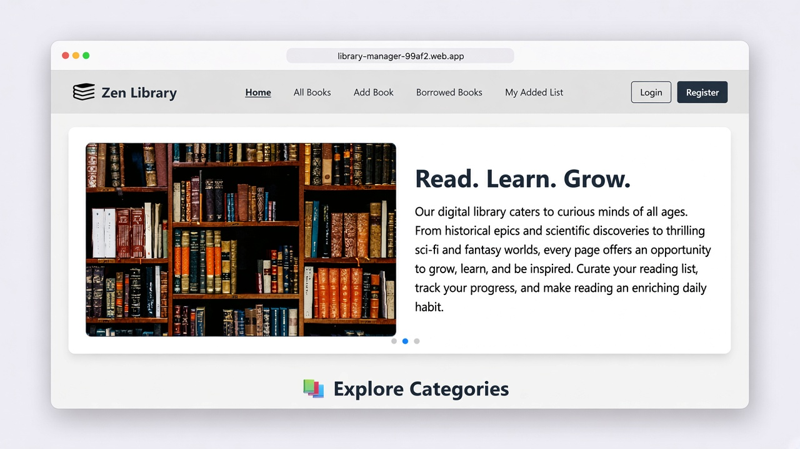

<p align="center">
  
</p>

<p align="center">
  <a href="https://library-manager-99af2.web.app">Live app</a>
  ·
  <a href="https://library-manager-server-ivory.vercel.app">Live API</a>
  ·
  <a href="https://github.com/achibhossengit/library-manager-client">Client Repo</a>
</p>

Zen Library is a full-stack library management system where readers can browse books by category, borrow available titles, and keep track of their own collection. Authenticated users can add books, update or delete titles they contributed, and return borrowed copies.

This repository is the **backend API**. It handles book data, borrowing logic, Firebase token verification, and MongoDB storage.

## ✨ Key Features

- REST APIs: Books, categories, and borrowed-list endpoints.
- Authentication: Firebase Admin verifies ID tokens on protected routes.
- Owner checks: Only the user who added a book can update or delete it.
- Borrowing: Decrease quantity and increment `borrowedCount` on borrow; restore quantity on return.
- Popular Books: Public list sorted by `borrowedCount`.
- Categories: Public category list used by the client filters and home carousel.

## 🚀 Tech Stack

| Category       | Technology                   |
| -------------- | ---------------------------- |
| Runtime        | Node.js, Express 5           |
| Database       | MongoDB (`LibraryManagerDB`) |
| Authentication | Firebase Admin               |
| Deployment     | Vercel                       |

## 🛠️ Installation & Setup

```bash
git clone https://github.com/achibhossengit/library-manager-backend.git
cd library-manager-backend
npm install
```

Create a `.env` file in the project root:

```env
DB_USER=<Your MongoDB username>
DB_PASSWORD=<Your MongoDB password>
```

Place the Firebase service-account JSON at `library-manager-firebase-private-key.json` in the project root. That file is gitignored.

```bash
node index.js
```

The API runs at [http://localhost:3000](http://localhost:3000).

## 📁 Project Structure

```text
index.js         Server entry, middleware, and REST routes
vercel.json      Vercel deployment
```

## ⚙️ Workflows

### 1. Authentication

- The client authenticates with Firebase, then sends the ID token in `Authorization`.
- Protected routes run `verifyFirebaseToken` and attach `authEmail` from the token.
- Email-scoped routes also run `verifyAuthEmail` so the token email matches the requested email.

### 2. Book Management

- Anyone can list books, filter by category, read popular books, or load a single book.
- Authenticated users create books with `POST /books`.
- Update and delete require a valid token **and** `authEmail === book.addedBy`.

### 3. Borrowing

- `POST /borrowed-list` inserts a borrow record, decrements `quantity`, and increments `borrowedCount`.
- Borrow is rejected if the book is missing or `quantity` is `0`.
- `DELETE /borrowed-list/return/:borrow_id` removes the record and increments `quantity` again.
- Only the borrower can return their own record.

## 🗃️ Database

MongoDB database: **`LibraryManagerDB`**

| Collection     | Purpose                                      |
| -------------- | -------------------------------------------- |
| `Books`        | Title, author, category, quantity, and owner |
| `BorrowedList` | Borrow records (`bookId`, `borrowedBy`)      |
| `Categories`   | Category name, image, and description        |

## 🔐 Authentication

Protected routes expect the raw Firebase ID token:

```http
Authorization: <Firebase ID token>
```

| Guard                 | Rule                                      |
| --------------------- | ----------------------------------------- |
| `verifyFirebaseToken` | Valid Firebase ID token                   |
| `verifyAuthEmail`     | Token email must match `email` in the request |

## 🔌 API Reference

### Root

| Method | Path | Access | Description        |
| ------ | ---- | ------ | ------------------ |
| `GET`  | `/`  | public | Health check       |

### Books — `/books`

| Method   | Path                | Access     | Description                          |
| -------- | ------------------- | ---------- | ------------------------------------ |
| `GET`    | `/books`            | public     | List books; optional `?category=`    |
| `GET`    | `/books/popular`    | public     | Top 6 by `borrowedCount`             |
| `GET`    | `/books/:bookId`    | public     | Single book                          |
| `GET`    | `/books/user/:email`| token+email | Books added by that user            |
| `POST`   | `/books`            | token      | Add a book                           |
| `PUT`    | `/books/:book_id`   | token+owner | Update a book you added             |
| `DELETE` | `/books/:book_id`   | token+owner | Delete a book you added             |

### Borrowed list — `/borrowed-list`

| Method   | Path                              | Access | Description                    |
| -------- | --------------------------------- | ------ | ------------------------------ |
| `GET`    | `/borrowed-list/ids`              | token  | Borrowed book IDs for the user |
| `GET`    | `/borrowed-list/books`            | token  | Full borrowed-book records     |
| `POST`   | `/borrowed-list`                  | token  | Borrow a book (`bookId`)       |
| `DELETE` | `/borrowed-list/return/:borrow_id`| token  | Return a borrowed book         |

### Categories — `/categories`

| Method | Path           | Access | Description     |
| ------ | -------------- | ------ | --------------- |
| `GET`  | `/categories`  | public | Category list   |
